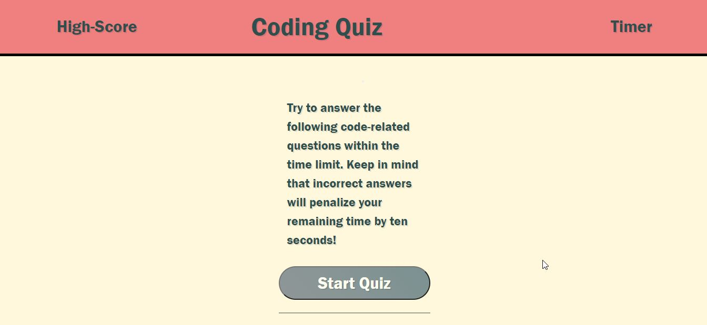

# Code-Quiz

## Overview: 

I built a timed coding quiz with multiple-choice questions that showcases dynamic elements created using JavaScript and stylized using CSS. Note: Along with creating JavaScript questions for the array I also pulled from w3schools and javatpoint JavaScript interview questions. 

## Technologies used: 
  * HTML
  * CSS
  * JavaScript

View live site at: https://reinholz36.github.io/Code-Quiz/

 

